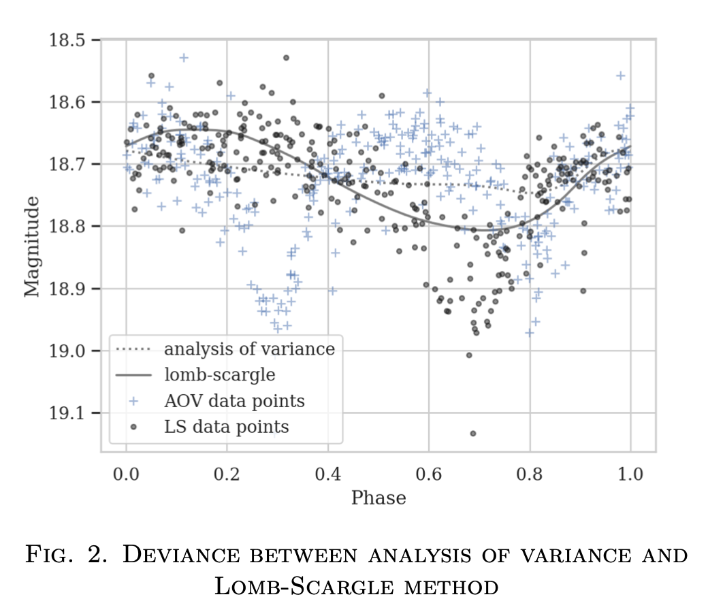
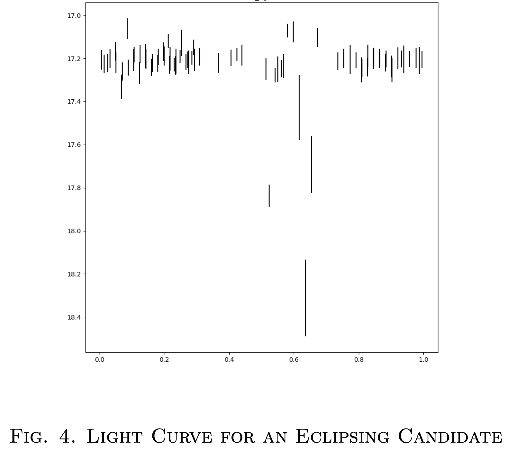

##### Abstract

Planetary nebulae are among one of most wondrous phenomena in the sky, remnants of exploding stars, forming multicolored clouds surrounding the cores of its hosting star. Binaries in the cores of planetary nebular are the key to understanding binary evolution; high cadence surveys such as the Zwicky Transient Facility are thus essential to the search. This project will explore the methods of finding the fraction of binary sources in planetary nebulae, probing questions for its evolution and morphology. Other than verifying the known binary sources among literature, we will take advantage of ZTF’s technology for discoveries of short-period binaries.

##### Background

Binary central stars of planetary nebula have been deemed important as:
* it expands the traditional view of PNe representing the final evolution stage of intermediate-mass stars.
* they are able to give insight to planetary nebulae morphologies and how their shapes come about.
* binaries can show periodicity associated to reflection, eclipses, and deformation.
* it can help better explain the poorly understood common-envelope phase in binary systems.
So far, there has not been a defined catalogue of binary central stars of planetary nebulae, which called for this project.

##### Objectives

Through PNe catalogues, we selected targets that have sufficient data on the ZTF survey. With that, we
* collected and folded lightcurves for each source per PNe.
* found their period through statistical methods.
* developed procedures and methods for identifying binary sources.
* followed-up with short period binaries and other interesting candidates.

##### Algorithms

The data was gathered through Caltech’s ZTF—a next-generation time-domain survey. We used partnership and Caltech’s high cadence fields located on the galactic plane for the extraction of light curves.

* [Lomb Scargle](https://docs.astropy.org/en/stable/timeseries/lombscargle.html)
* [Analysis of Variance: vartools](https://www.astro.princeton.edu/~jhartman/vartools.html)
* [Conditional Entropy](http://www.cs.cmu.edu/~venkatg/teaching/ITCS-spr2013/notes/lect-jan17.pdf)

We tested several period-finding methods for our light curves and revealed that for our purposes, analysis of variance and conditional entropy were the most suitable. We were able to extract periods and lightcurves for more than 7,000 PNe sources.

##### Results

As of the tenth week, we:
* narrowed down to 838 candidates that has relatively high confidence among observations.
* folded 7,869 light curves of PNe sources using conditional entropy.
* are currently following up with 5 candidates that shows high confidence in binarity.

##### Conslusion & Further Studies

To further study the subject, we should:
* identify companion stars by examining their colors;
* use binary fraction to further probe questions for PNe morphology; and
* amend updated ZTF data for PNe as the survey grows.

We were able to analyze ZTF data available for many, but not all PNe and extract their periods. These statistical period-finding methods are thus tested and compared first-hand in this project. With this project as a motivation and more ZTF data to come, an accurate and updated binary fraction value is anticipated.

